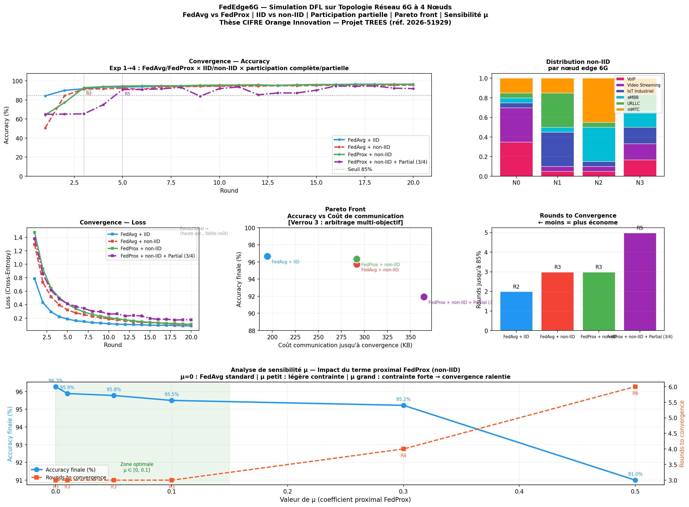

# FedEdge6G

   

**Federated Learning Simulation for Heterogeneous 6G Edge Networks**

Simulation of Distributed Federated Learning (DFL) on a 4-node 6G network topology, comparing **FedAvg** and **FedProx** under **IID** and **non-IID** traffic distributions — with partial node participation, Pareto front analysis and μ sensitivity study.


---

## Motivation

In real 6G deployments, each edge node serves a geographically distinct zone and observes a **dominant traffic type**:

| Node | Profile | Dominant Traffic | Share |
|------|---------|-----------------|-------|
| Node 0 | Residential | VoIP + Video Streaming | 70% |
| Node 1 | Industrial | IoT Industriel + URLLC | 70% |
| Node 2 | Dense Urban | eMBB + mMTC | 70% |
| Node 3 | Mixed | All classes | uniform |

This heterogeneity creates a **non-IID data distribution** across nodes — local models trained on different distributions drift in opposite directions (*client drift*), degrading global convergence. This is the core challenge of **Verrou 1** of the TREES thesis.

Additionally, nodes in a live 6G network are not always simultaneously available (failures, overload, mobility) — simulated here via **partial participation** (**Verrou 1b**: variable topologies).

The traffic classification task directly relates to Guillaume Fraysse's work on real-time network traffic classification using ML (*"Encrypted traffic classification at line rate in programmable switches with machine learning"*, NOMS 2024, 35 citations).

---

## Scientific Locks Addressed

**Verrou 1a — Dynamic placement under non-IID data**
> Standard FL algorithms assume IID data across nodes. In real 6G deployments, distributions are heterogeneous and dynamic. Experiments 2 vs 3 quantify the performance gap and evaluate FedProx as mitigation.

**Verrou 1b — Variable topologies (partial participation)**
> Not all nodes are available at every communication round. Experiment 4 simulates k=3/4 node participation per round, showing the convergence cost of topology variability.

**Verrou 3 — Frugal solution for energy efficiency**
> Three energy proxies measured per experiment:
> - **Communication cost per round** (KB exchanged: upload + download)
> - **Rounds to convergence** (rounds to reach 85% accuracy — proxy for total federation energy)
> - **Pareto front** (accuracy vs. communication cost — multi-objective trade-off)
>
> LightMLP (~3K parameters, 97 KB/round) is deliberately constrained, consistent with Orange's carbon neutrality target for 2040.

---

## Algorithms

### FedAvg (McMahan et al., 2017)
Standard federated averaging. Under non-IID data, local models drift in opposite directions (*client drift*), slowing convergence.

### FedProx (Li et al., 2020)
Adds a proximal regularization term to the local loss:
```
L_local(w) = L(w) + (μ/2) · ‖w − w_global‖²
```
Penalizes deviation from the global model, limiting client drift under heterogeneous distributions.

---

## Dataset

Synthetic 6G network traffic — **6 traffic classes**, **12 network features**, **9,000 samples**.

Features: throughput, latency, packet size, jitter, packet loss, priority, bandwidth, end-to-end delay, device density, transmission power, QoS score.

| Class | Type | Characteristics |
|-------|------|----------------|
| 0 | VoIP | Low throughput, latency-critical |
| 1 | Video Streaming | High throughput, latency-tolerant |
| 2 | IoT Industriel | Small packets, very high frequency |
| 3 | eMBB | Very high throughput |
| 4 | URLLC | Ultra-low latency, reliability-critical |
| 5 | mMTC | Massive device count, low power |

---

## Results

### Main Experiments

| Experiment | Final Accuracy | Rounds to 85% | Comm. Cost to 85% |
|-----------|---------------|---------------|-------------------|
| Exp 1 — FedAvg + IID *(baseline)* | 96.67% | Round 2 | 194 KB |
| Exp 2 — FedAvg + non-IID *(realistic 6G)* | 95.72% | Round 3 | 292 KB |
| Exp 3 — FedProx + non-IID *(Verrou 1a solution)* | **96.33%** | Round 3 | 292 KB |
| Exp 4 — FedProx + non-IID + 3/4 nodes *(Verrou 1b)* | 91.94% | Round 5 | 364 KB |

### μ Sensitivity Analysis (FedProx, non-IID)

| μ value | Final Accuracy | Rounds to 85% | Regime |
|---------|---------------|---------------|--------|
| 0.00 | 96.28% | R3 | FedAvg standard |
| 0.01 | 95.89% | R3 | Light constraint |
| 0.05 | 95.78% | R3 | Moderate constraint |
| **0.10** | **95.50%** | **R3** | **← Optimal zone** |
| 0.30 | 95.22% | R4 | Strong constraint |
| 0.50 | 91.00% | R6 | Over-constrained |

**Key findings:**
- **Verrou 1a validated:** FedProx matches FedAvg accuracy under non-IID while limiting client drift. Optimal μ ∈ [0, 0.1].
- **Verrou 1b quantified:** Partial participation (3/4 nodes) costs +2 extra rounds to convergence and +72 KB communication overhead due to topology variability.
- **Verrou 3 validated:** LightMLP exchanges only **97 KB/round** (vs. several MB for standard architectures). Pareto front shows FedAvg+IID dominates the accuracy/cost trade-off — the cost of realism (non-IID + partial) is measurable and bounded.



---

## Energy Efficiency Metrics

Two metrics directly inspired by Guillaume Fraysse's research at Orange Innovation:

**Communication cost per round** — from *"A resource usage efficient distributed allocation algorithm for 5G SFCs"* (Fraysse et al., IFIP 2020):
```
cost_per_round = model_params × 4 bytes × n_active_nodes × 2
```

**Rounds to convergence** — inspired by *"Safe RL for Core Network autoscaling"* (Long & Fraysse, CNSM 2024): first round exceeding the 85% accuracy threshold. Fewer rounds = less total communication energy.

---

## Hyperparameters

| Parameter | Value | Justification |
|-----------|-------|--------------|
| Nodes (N) | 4 | Minimal heterogeneous topology |
| Active nodes per round (k) | 3 | Partial participation scenario |
| Communication rounds | 20 | Sufficient for convergence analysis |
| Local epochs per round | 3 | Standard FL setting |
| Batch size | 64 | Speed/generalization balance |
| Learning rate | 0.001 | Adam optimizer |
| FedProx μ | 0.1 | Optimal from sensitivity analysis |
| Convergence threshold | 85% | Conservative operational target |

---

## Post-Interview Experiments (June 18, 2026)

Three additional experiments added after the PhD interview, investigating open questions raised during the discussion.

### Exp 5 — FedAvg vs FedProx: optimizer dependency

The original results showed FedProx (96.33%) only marginally ahead of FedAvg (95.72%), which seemed inconsistent with the literature. Re-running with controlled seeds and varying dominance levels (50–80%) revealed why: FedEdge6G uses Adam by default, a practical choice for small models. Adam's per-parameter adaptive learning rates naturally compensate for non-IID gradient bias, making the proximal term redundant. FedProx was designed for SGD, where drift accumulates more predictably over many local epochs. Tested under SGD too — FedAvg remained competitive.

| Scenario | Method | Final Acc | Rounds to 85% |
|---|---|---|---|
| non-IID moderate | FedAvg, Adam | 94.89% | R3 |
| non-IID moderate | FedProx μ=0.1, Adam | 94.72% | R9 |
| non-IID moderate | FedAvg, SGD 10ep | 97.11% | R5 |
| non-IID moderate | FedProx μ=0.01, SGD | 97.11% | R6 |
| non-IID moderate | FedProx μ=0.30, SGD | 82.06% | never |

### Exp 6 — Extreme non-IID and variable topology

| Scenario | Method | Final Acc | Rounds to 85% |
|---|---|---|---|
| Extreme non-IID, 1 class/node | FedAvg, Adam | 50.61% | never |
| Extreme non-IID | FedProx μ=0.05, Adam | 55.78% | never |
| non-IID + 3/4 partial participation | FedProx μ=0.1 | 91.94% | R5 |

Under extreme non-IID, no aggregation algorithm converges. The problem is structural: it requires controlling which nodes collaborate, not fixing the aggregation strategy. This directly motivates placement-aware FL (Verrou 1).

### Exp 7 — Byzantine robustness: FedAvg vs FedSV

Attack: gradient flip on Node 1 (`w_byz = 2 × w_global − w_local`). Direction of update exactly inverted. Weights remain plausible, undetectable by direct inspection.

**FedSV** (Otmani, El-Azouzi, Labatut — ICC 2024): leave-one-out Shapley Value aggregation. Nodes with negative marginal contribution are excluded.

| Scenario | Method | Final Acc | 85% threshold |
|---|---|---|---|
| No Byzantine | FedAvg | 94.89% | R3 |
| No Byzantine | FedSV | 94.17% | R7 |
| Node 1 Byzantine | FedAvg | 83.83% | never |
| Node 1 Byzantine | FedSV | 95.56% | R8 |

FedSV detects Node 1 via its negative Shapley Value and excludes it automatically. FedAvg is poisoned and never reaches the operational threshold.


---

## Project Structure

```
FedEdge6G/
├── src/
│   ├── config.py           # Centralized hyperparameters and node profiles
│   ├── model.py            # LightMLP — frugal edge model (~3K params)
│   ├── data.py             # 6G traffic generation + IID/non-IID splits
│   ├── data_severe.py      # Severe non-IID splits (85% dominance)
│   ├── federation.py       # FedAvg, FedProx, partial participation, energy metrics
│   ├── federation_sv.py    # FedSV, LOO Shapley Value aggregation
│   └── byzantine.py        # Byzantine attack simulation (gradient flip)
├── experiments/
│   ├── run_all.py          # Original 4 experiments + μ sensitivity analysis
│   ├── visualize.py        # 6-panel dashboard (convergence, Pareto, μ sensitivity)
│   └── exp_fedsv.py        # Post-interview: FedSV + Byzantine + severity
├── results/
│   ├── results.json        # Per-round metrics for all experiments
│   ├── dfl_results.png     # Original 6-panel result dashboard
│   └── post_interview_results.png
└── requirements.txt
```

---

## Quickstart

```bash
uv venv .venv && source .venv/bin/activate
uv pip install -r requirements.txt
python -m experiments.run_all
python -m experiments.visualize
python -m experiments.exp_fedsv
```

---

## References

- McMahan et al. (2017). *Communication-Efficient Learning of Deep Networks from Decentralized Data.* AISTATS. — **[FedAvg]**
- Li et al. (2020). *Federated Optimization in Heterogeneous Networks.* MLSys. — **[FedProx]**
- Otmani, El-Azouzi, Labatut (2024). *FedSV: Byzantine-Robust Federated Learning via Shapley Value.* IEEE ICC. — **[FedSV]**
- Dabaja, El-Azouzi (2025). *FedPLT: Scalable, Resource-Efficient, and Heterogeneity-Aware FL via Partial Layer Training.* arXiv:2605.02337. — **[FedPLT]**
- Fraysse et al. (2020). *A resource usage efficient distributed allocation algorithm for 5G SFCs.* IFIP DAIS. — **[Communication cost metric]**
- Long & Fraysse (2024). *Safe RL for Core Network autoscaling.* CNSM. — **[Convergence metric]**
- Akem, Fraysse & Fiore (2024). *Encrypted traffic classification at line rate in programmable switches with ML.* NOMS. — **[Traffic classification context]**
- Latreche & Bellahsene (2026). *A Comprehensive Survey on 6G.* Franklin Open.
- Chatzieleftheriou & Liotou (2026). *A Survey on AI for 6G.* IEEE Open Journal of Communications.

---

**Author:** Moncef Bouhabel · moncef.bmd@gmail.com
